# Task Manager #
_A simple tool to help you get an overview of the workload_

[View the live site here](#)

## Table of contents ##

* [UX](#ux)
    * [Introduction & Project Goals](#introduction--project-goals)
    * [User Stories](#user-stories)
    * [Development Planes](#development-planes)
    * [Skeleton](#skeleton)
    * [Design](#design)
    * [Features](#features)
* [Technologies](#technologies)
    * [Languages](#languages)
    * [Tools](#tools)
    * [Libraries](#libraries)
    * [Database Management](#database-management)
* [Testing](#testing)
* [Bugs](#bugs)
* [Deployment](#deployment)
* [Credit](#credit)
* [Acknowledgements](#acknowledgements)
---

## UX ##

### Introduction & Project Goals ###

Task Manager is a simple way to keep a comprehensive overview of the workload. It`s divided into different departments, but all departments can see all tasks on every department and also create a new task on the appropriate department.

The Project Goal is to make the days at the office more easy and transparent across the different departments. 

This is the third of four Milestone Projects the developer needs to complite, to achieve the Diploma in Software Development.

The main requirements on this project was to build a full-stack website, where users could manage a common dataset, using **HTML5**, **CSS3**, **JavaScript**, **Python**, **Flask** and **MongoDB**.

### User Stories ###

* As a general user I want to:

    * Se a simple application with calm colors without a lot of distractions
    * Se the workload accross the departments
    * See who made the task 
    * Have the opportunity to Sign Up for access to more features

* As a logged in user, in addition to the general above, I want to: 

    * Be able to create tasks on the department of my own choice
    * Edit and delete tasks created by me

* As an Admin user I want to:

    * Create a new department
    * Edit department
    * Delete department

### User Goals ###

* A simple Task Manager to keep track of the workload with the easy-to-use management system, using the basic **CRUD** functions: Create, Read, Update and Delete. 

    * Create Tasks
    * See all Tasks
    * Update Tasks
    * Delete Tasks

### Site Owner Goals ###

* Develop a tool to make the workdays more easy and transparent

 * The user feels included
 * The user have the opportunity to update on workload
 * The user gets a simpler and more clear workday

### Development Planes ###

In order to create an application that fulfilled the expectations as described above, the developer used her experience from her daily work.

### Strategy ###

Divided into three categories, the website will focus on the following target audiences:

* ### Roles: ###

    * Regular employees in all departments
    * Leaders in all departments
    * Top leaders
    * Business owners

* ### Demographic: ###

    * Newly hired
    * Old trotters
    * Likes to stay up to date

* ### Psychographics: ###

    * Organised
    * Structured
    * Work culture

### Scope ###

#### User Requirements And Expectations ####

* Content that is visually appealing with calm colors
* Content is well structured
* Easy to navigate the application using the respective buttons  
* Easy to understand how to use the application
* Easy to read typography
* Operational link to **GitHub**, **Slack** and **LinkedIn** that opens in a new tab  
* Opportunity to Sign In
* Opportunity to create, edit and delete own tasks
* Tasks have a descreption and due date
* See all tasks accross departments
* Admin user has the opportunity to mange the departments

### Skeleton ###

Wireframes was made in [Balsamiq](https://balsamiq.com/). As in previous projects feedback on using [Figma](https://www.figma.com/), was that Balsamiq was a better choice.

### Design for mobile device: ###

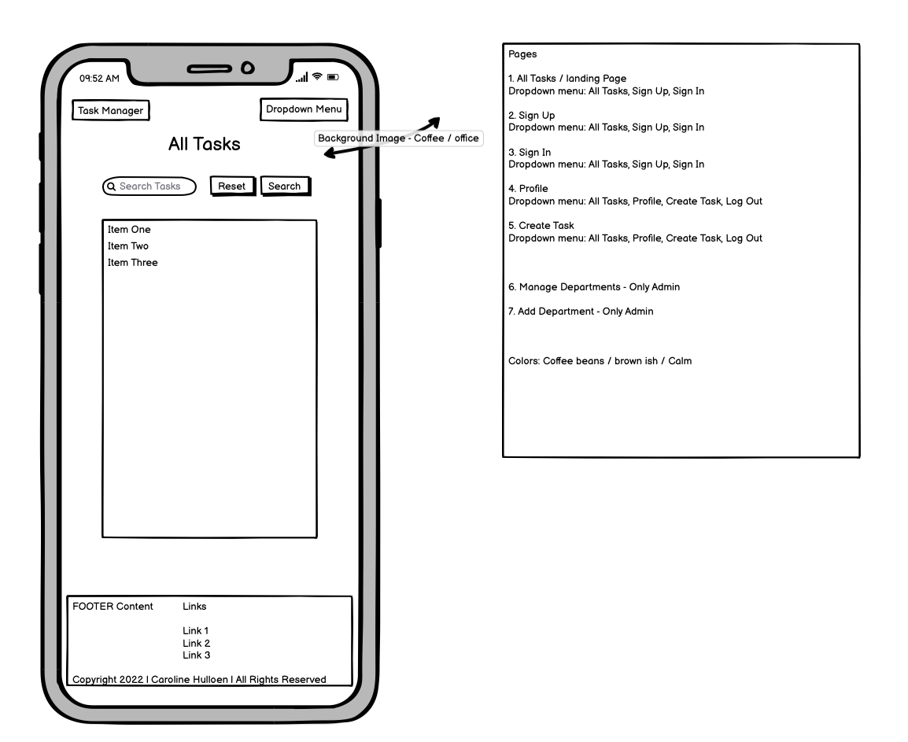
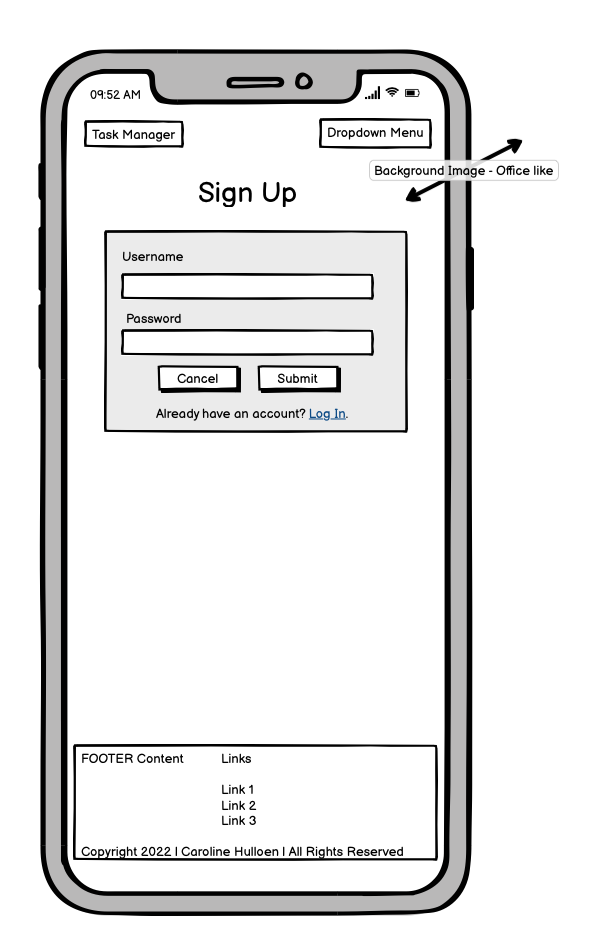
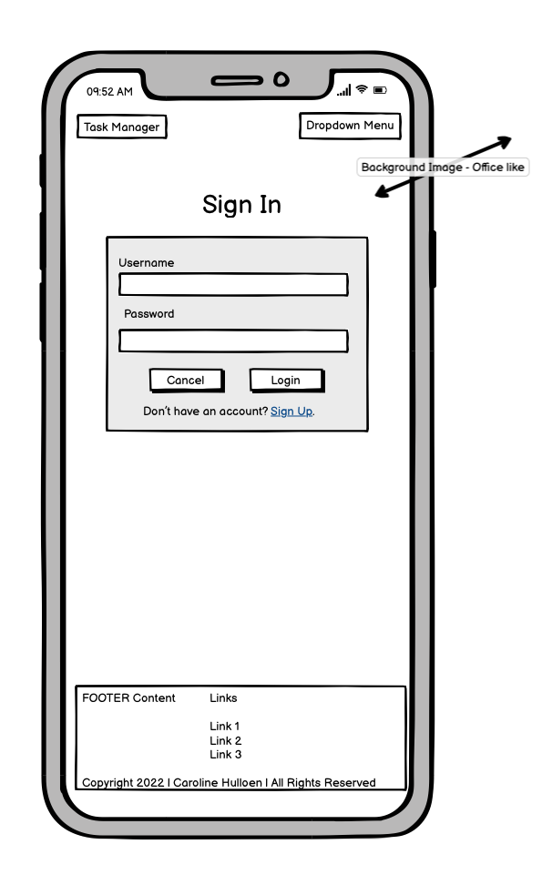
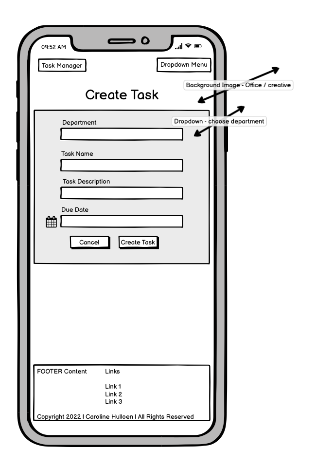
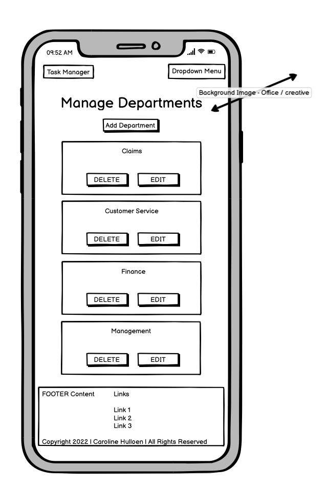
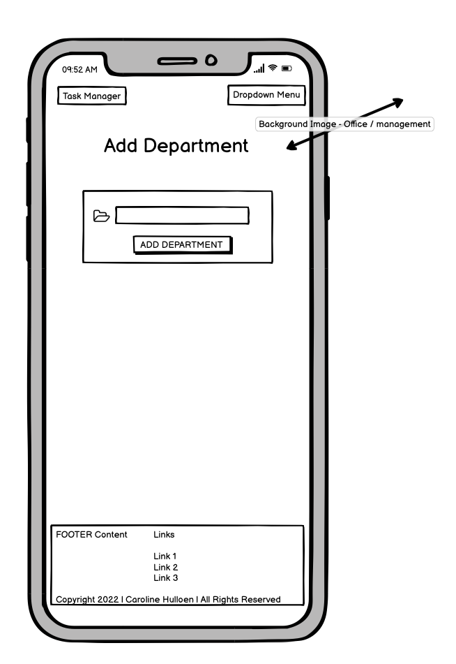

### Design for desktop device: ###

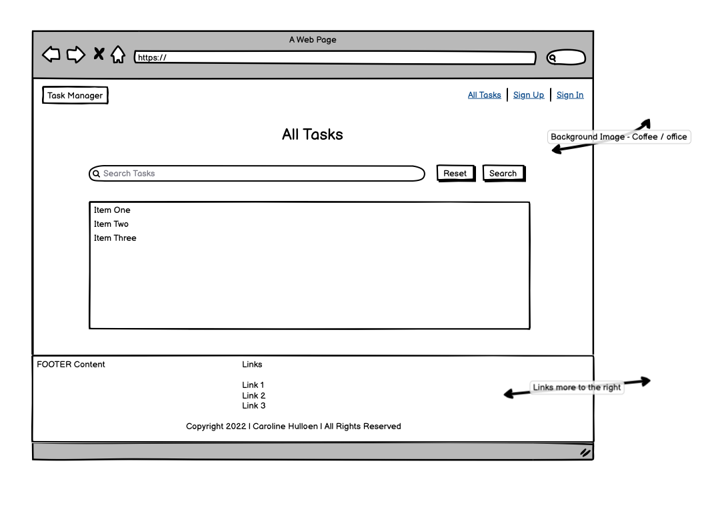
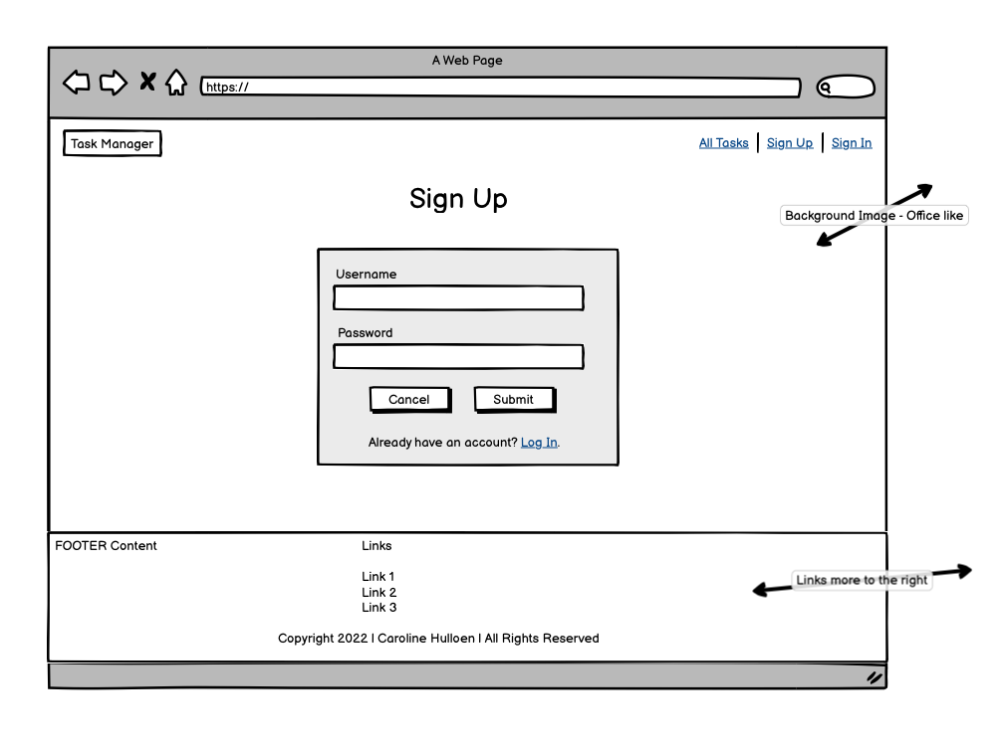
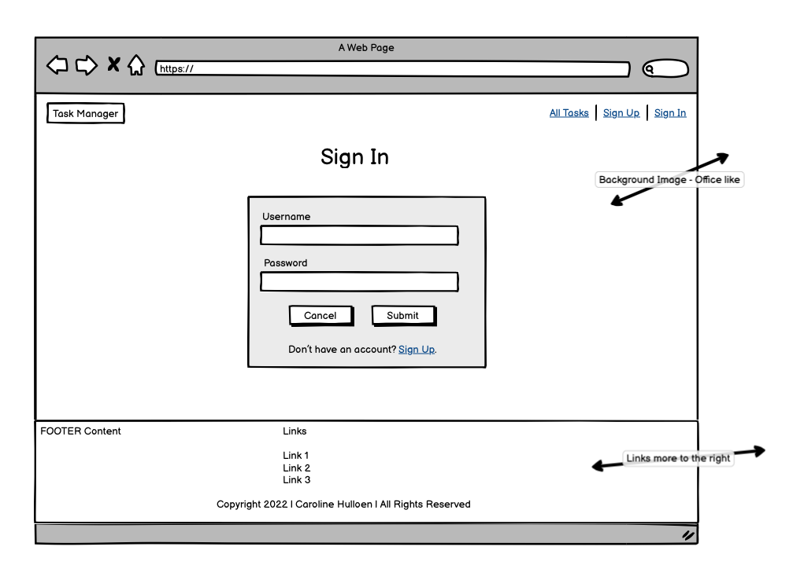
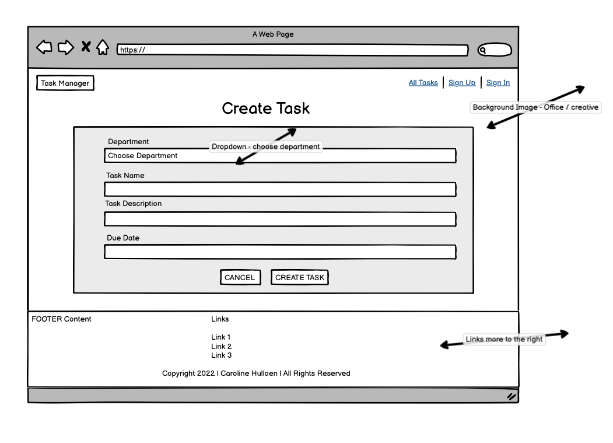
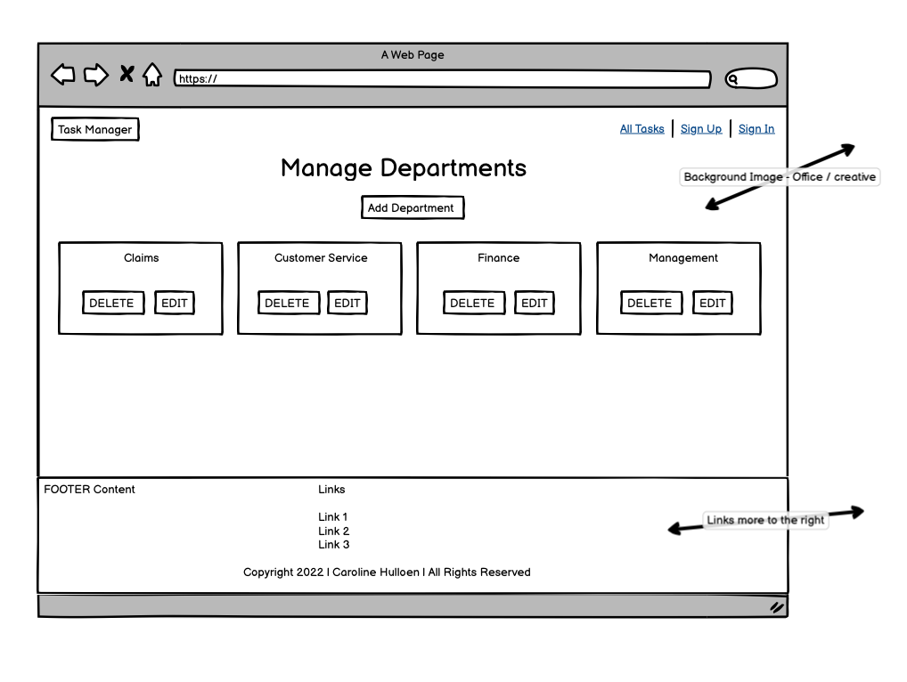
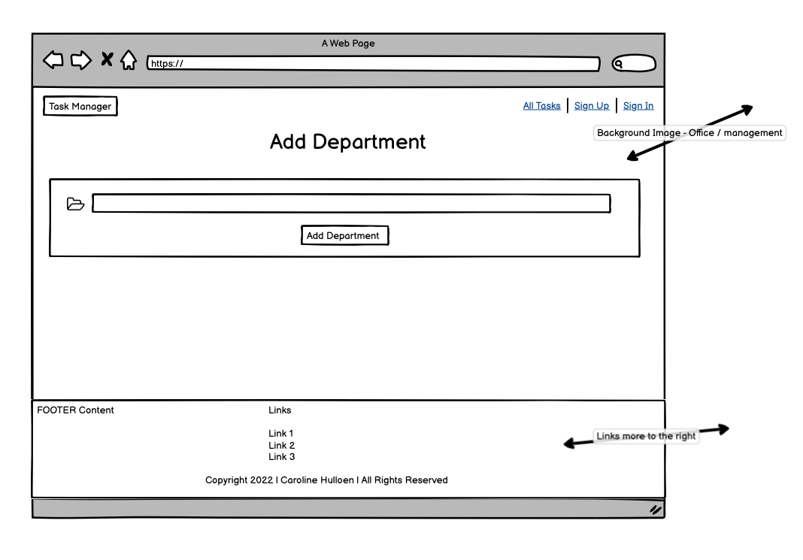

### Changes from wireframes to live site ###

First it was thought that each page would have different background image, but the developer thought the coffee-bean background was great on all pages to keep it consistent. Besides from that it turned up almost like the wireframes.

### Design ###

The design of this application has been created based on a "keep it simple" mindset. It has a lot of different user personalities, and it is not an application to hang out on. The users is at work, and it is a quick in and out application. Calm colors without distractions and unnecessary content. 

When entering the application you immediately see all tasks, the user does not have to sign up / in unless they want to create, edit or delete a task. 

[Jinja](https://jinja.palletsprojects.com/) was used to extend the `base.html` page, for consistency accross all pages.

* Fonts

[Google Fonts](https://fonts.google.com/specimen/Roboto): Roboto, sans-serif.
This Font is used because it is a clean and simple Font. 

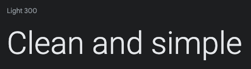

* Icons

[Fontawsome](https://fontawesome.com/) provided all the icons used in the application.

* Colours

All the colours where picked to ensure a calm and harmonious impression. 

    * Navbar, Footer and Containers: Silver Pink, #bcaaa4
    * Buttons : Isabeline, #efebe9 and Cinereous, #a1887f
    * Text and Icons: White, #fff and Isabeline, #efebe9
    * Collapsible and dropdown: Cinereous, #a1887f
    * Hover: Pale Silver, d7ccc8
    
Color Sheme from [Coolors](https://coolors.co/)
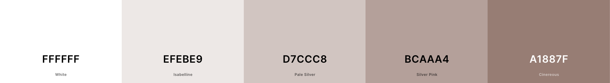

### Features ###

The web application has a responsive layout with a reverse mindset relative to the mobile-first way of thinking. As it will be used at the office, and desktop screen.
But of course it can also be used from a phone.

Features that have been implemented:

* Search Tasks
* Sign Up
* Sign In
* Create, edit and delete Tasks
* Create, edit and delete Departments

* Flash messages if username exists or wrong password 
* Flash messages when logged in or out
* Flash messages when manage tasks or departments

* Custom 404 Page
* Custom 500 Page
* Favicon

* Links to the developers **GitHub** and **LinkedIn**
* General link to **Slack**, just because it is amazing

Features that will be implemented in the future:

* Sort Taks by date
* See how many tasks that been solved
* Assign tasks to another user 
* Anonnymous suggestion function

### Technologies ###

### Languages ###

* [HTML5](https://en.wikipedia.org/wiki/HTML5)
* [CSS3](https://en.wikipedia.org/wiki/CSS)
* [JavaScript](https://no.wikipedia.org/wiki/JavaScript)
* [Python](https://en.wikipedia.org/wiki/Python_(programming_language))

### Tools ###
### Libraries ###

* [Flask](https://en.wikipedia.org/wiki/Flask_(web_framework))

### Database Management ###

* [MongoDB](https://en.wikipedia.org/wiki/MongoDB)

### Testing ###

### Bugs ###

### Deployment ###

### Credit ###

### Acknowledgements ###