# Testing #

Back to [README.md](README.md) file.

---

## Table of contents ##

1. [Testing User Stories](#Testing-User_Stories)
2. [Manual Testing](#Manual-Testing)
3. [Automated Testing](#Automated-Testing)
4. [Bugs](#Bugs)

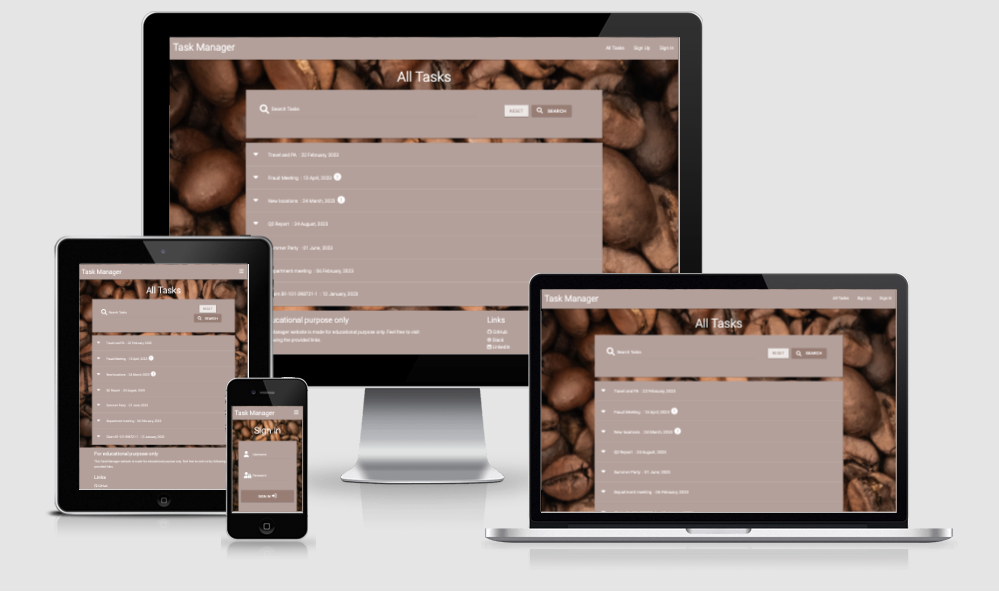

---

### Testing User Stories ###

* As a general user, I want to:

  * Se a simple application with calm colours without a lot of distractions

    When enter the application, the user meets a background image of coffee-beans, and harmonious colors on the navbar, main content and footer. There are no unnecessary or disturbing elements. The color palette follows throughout the application. 

  * Se the workload accross the departments

    The workload is showing immediately when the user enters the page

  * Se who made the task

    The user can se who made the task, by clicking on the prefered task. A dropdown with the desired information will show. 

  * Have the opportunity to Sign Up, for accsess to more features

    The user can easily Sign Up by pushing the Sign Up button in the navbar.

* As a logged in user, in addition to the general above, I want to:

  * Be able to create tasks on the department of my own choice

    The user can easily create own tasks by pushing the Create Task in navbar. This is now available as a signed in user. 

  * Edit and delete tasks created by me

    The user can do this from the main page, All Tasks - or in the profile page. In the profile page, is only the tasks created by the logged in user visible. This would be the preferred method in case there is a lot of tasks.

  * See my created task on my profile page

    The user can easily see the created tasks by entering the profile page. 

* As an Admin user, in addition to the above, I want to: 

  * Create a new department

    Admin can create a new department by pushing the Manage Departments, on navbar.

  * Edit department

    Admin can easily edit department when on the Manage Department page, by pushing EDIT.

  * Delete department

    Admin can delete department when on the Manage Department page, by pushing DELETE.

### Manual Testing ###

* All Tasks Page

  Navbar is working as it should, directs to the right page. Also in collapsible mode for mobile.

  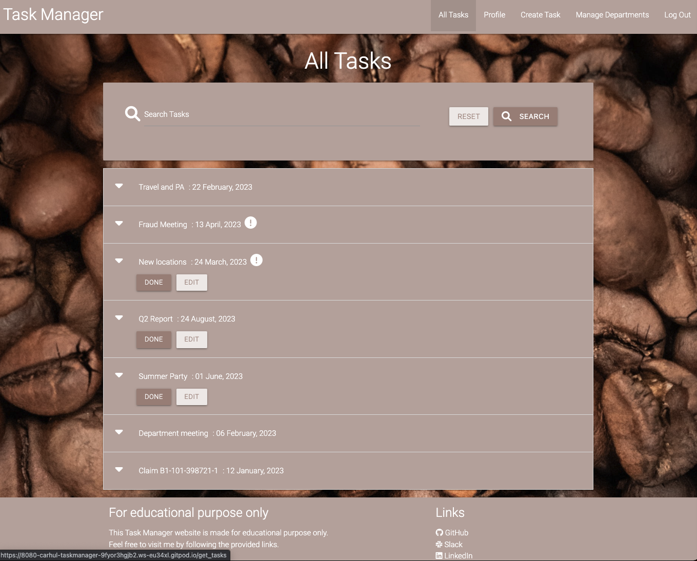

  Search function throws an 405 error:

  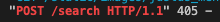
  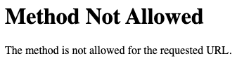

    With help from mentor there was some changes:  
    query = request.form.get("query") TO query = request.args.get("query").  
    We also changed the request method to GET.

    I also needed to create a new DEBUG variable, so I did not have to kill and restart the server to see every change. 

    The Tasks looks good on all screens except a few mobile. Talked to my mentor about this, and as long as it works fine on most of the newer devices it should be fine, as this is not the main goal for this project. 

    Galaxy Fold error:

    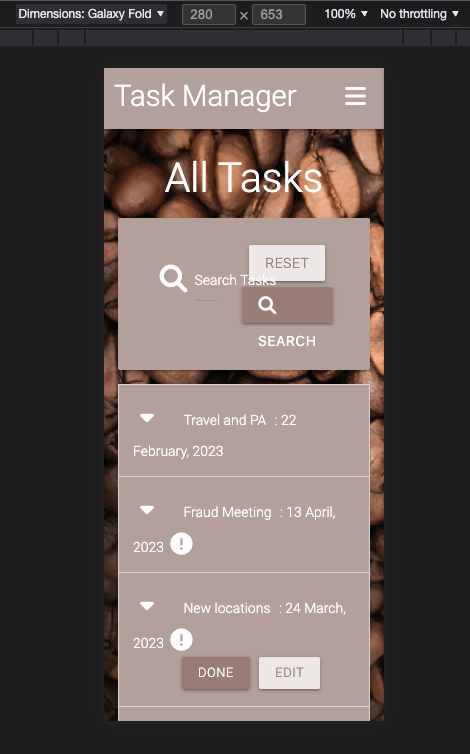

* Edit Task

  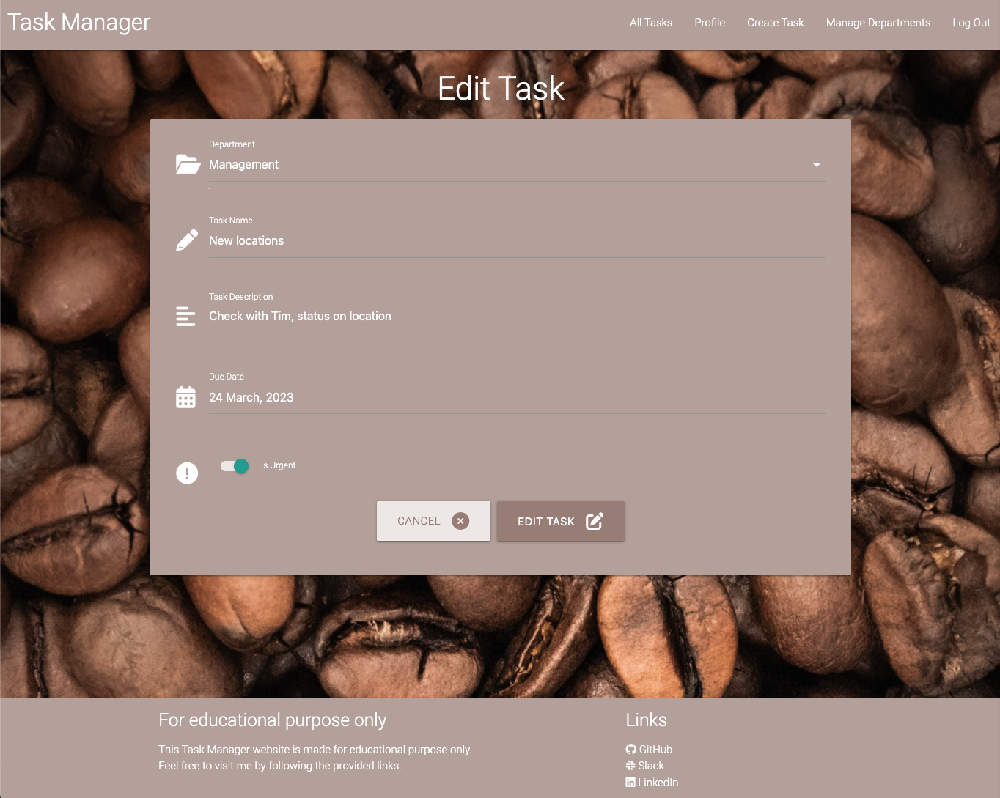

* Profile Page

  Profile page is fine, except same error as above with the tasks. 
  The user can EDIT a task, or make it disappear by marking it DONE. 

  Flash messages working. 

  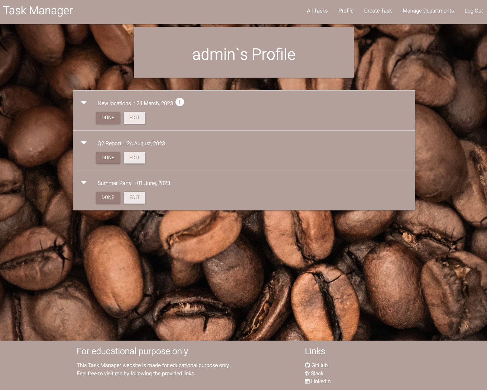

* Create Task Page

  Create Task works fine, choose department on dropdown, input fields for Task Name and Task Description is working, Due Date is fine. 

  Is urgent is working, but not perfectly aligned. This should be corrected in the future.

  User can choose to CANCEL og CREATE TASK, flash messages is working. 

  Validation also ok. 

  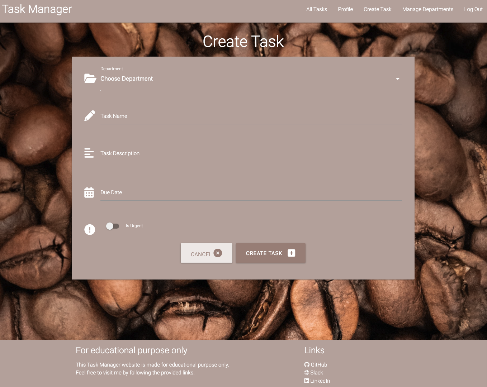

* Manage Departments

  Add, edit and delete; all good. 

  Same error as before with the Galaxy Fold:

  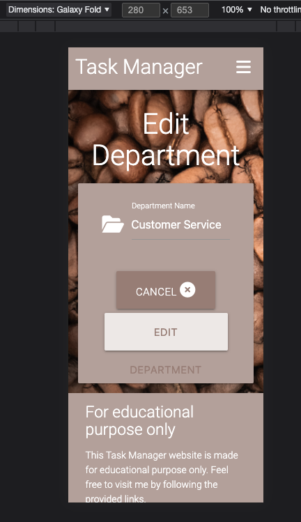

  Else, looks good. Test Department to se flash message when delete. 

  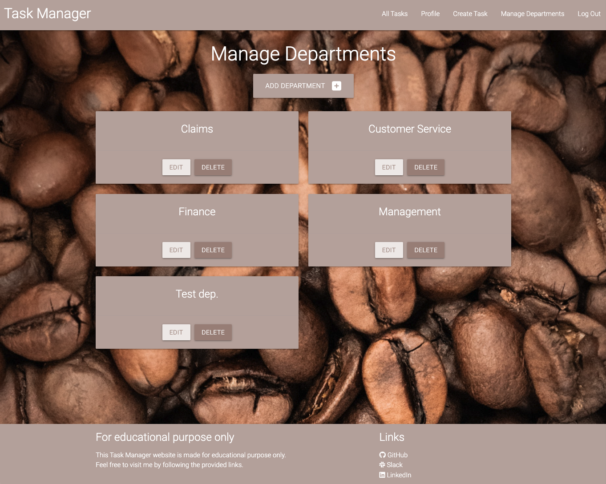

* Add Department

  On this, you need to push the line, and not just in the imput field to make it work. Mentor was unsure about why it was like this, but it works. And would need to be checked further in the future.

  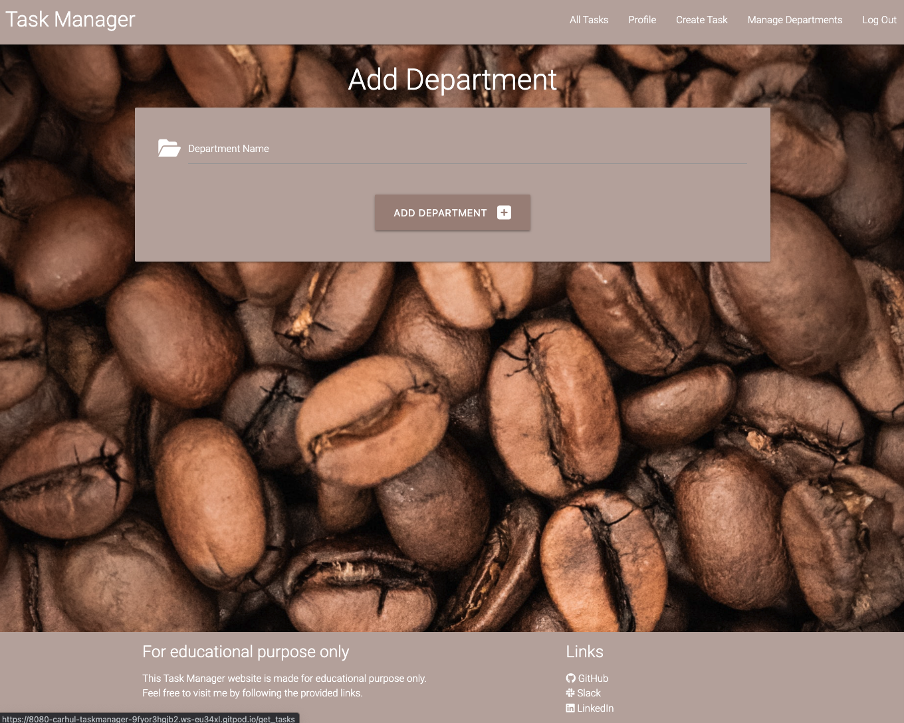

  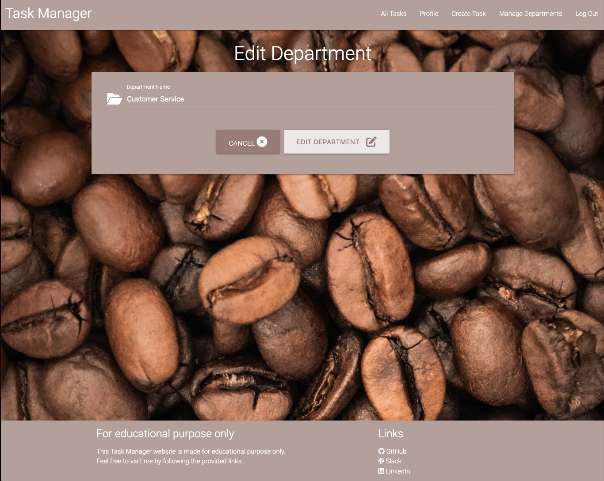

* Links

  All three links directs the user to the correct site, on a new tab.

* Error Pages
  
  404:

  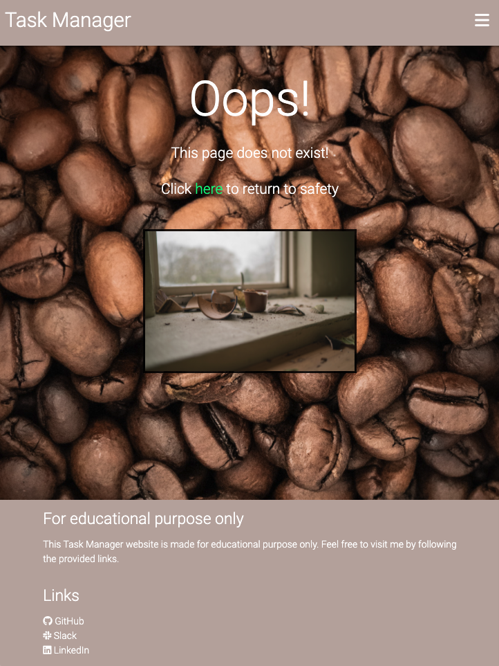

  500:

  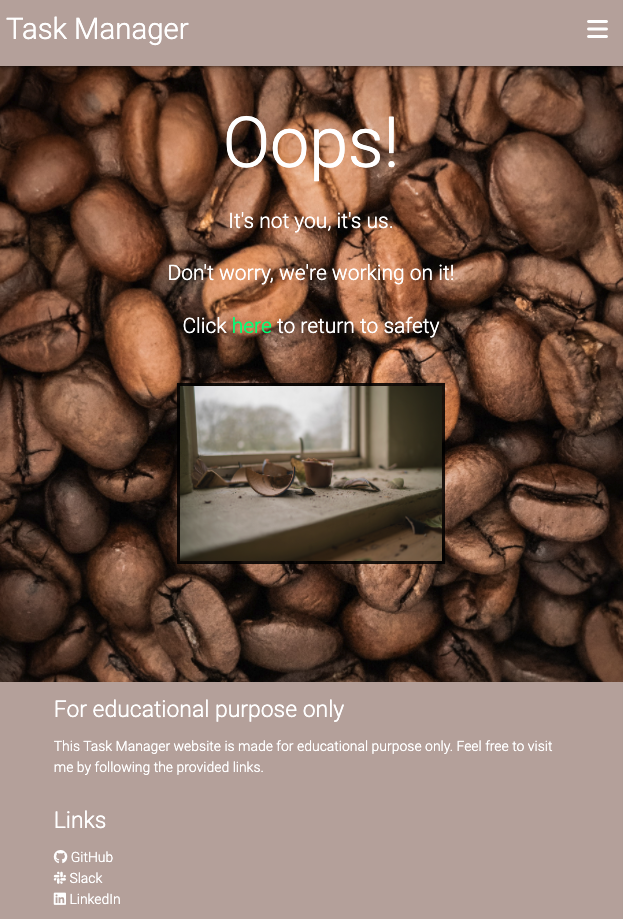

* User Testing

  I asked my family and friends to test the application, and the feedback was good. The only thing that they missed, was to have an warning before delete button. I agree, that should have been done, and will be in the future.

  Else they liked the background image and the colors. Also the simplicity was appreciated.

### Automated Testing ###

### Bugs ###

* Problem in the beginning of the project, the test task did not show, and I was unable to continue the project before it was solved, as the whole project was depending on the conection with MongoDB. After a day with different debugging, I found that the spelling in the code and in MongoDB was not the same..

* TypeError: object of type 'Cursor' has no len().  

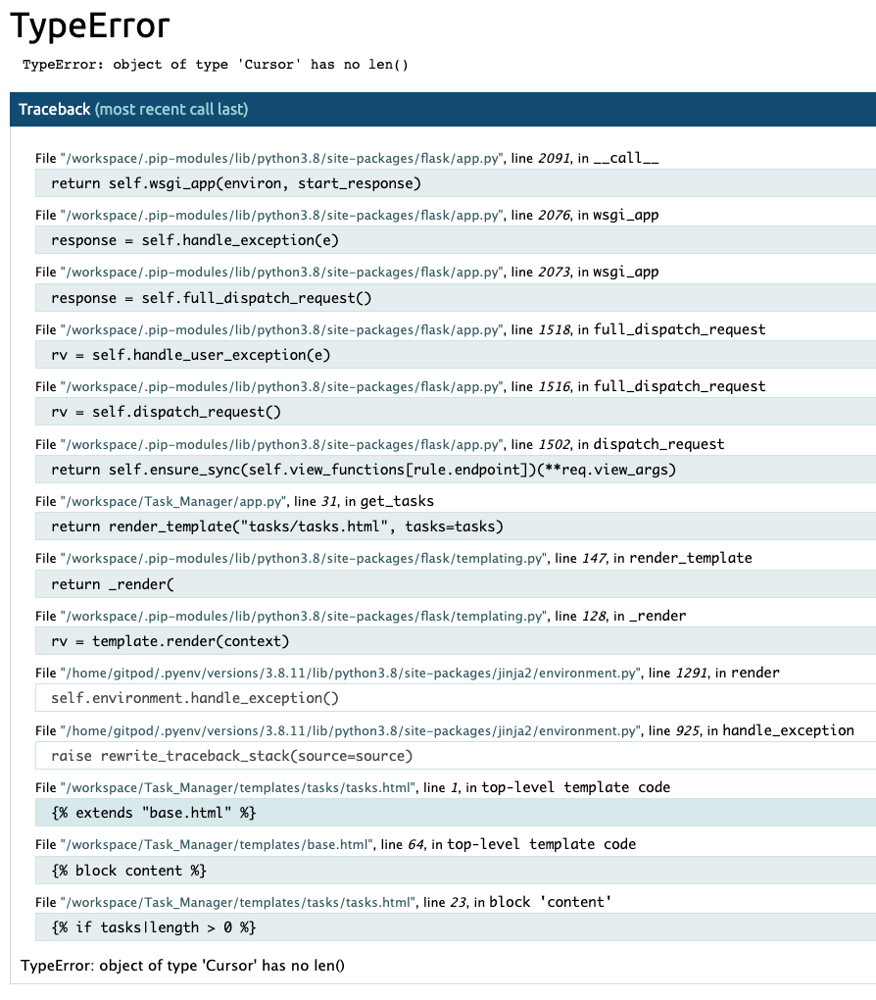

The solution: I first thought that changing to a list in app.py and  in the tasks.html would solve the problem, but then I got a new error. Then I realised that I had forgot to import text index to Python Shell.

* SyntaxError
  
  An extreamly simple error, that I used to much time figuring out. I was obviously missing the colon..

  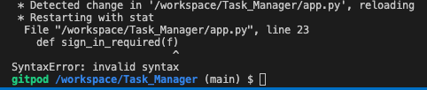

 